# Implementation Plan: ⟨Pilot | Wave⟩ : Decoherence

A hybrid cyberpunk shoot 'em up (shmup) and roguelite built in **Godot 4**, blending the accessible, readable flight combat of *1942* with the emergent, "game-breaking" item synergies of *The Binding of Isaac*, grounded in high-energy quantum physics lore and de Broglie's deterministic Pilot Wave theory.
- **Official Title**: `⟨Pilot | Wave⟩ : Decoherence`
- **Shorthand / Moniker**: *Pilot Wave* / *PWD*
- **Project Directory**: `C:\Users\family\.gemini\antigravity-ide\scratch\pilot-wave-d`

---

## Approved Design Decisions

> [!NOTE]
> - **Target Platforms: PC, Mobile & Web (HTML5)**:
>   - **Universal Compatibility Renderer**: Configured with Godot 4's **Compatibility (OpenGL 3 / WebGL 2)** renderer, guaranteeing identical high-performance execution across **Desktop (Windows/macOS/Linux), Mobile (Android/iOS), and Web Browsers (HTML5/Wasm for itch.io / web portals)**.
>   - **Dynamic Responsive Orientation**:
>     - Desktop / Wide Browser: Automatically defaults to **Landscape (16:9 Horizontal)**.
>     - Mobile / Tall Browser: Automatically defaults to **Portrait (9:16 Vertical)**.
>     - Real-time window resize & orientation listener adjusts the layout dynamically if the browser is resized or mobile device is rotated.
>   - **Web-Safe Typography & Asset Standards (No Emojis / Exotic Glyphs)**:
>     - **Strict Emoji Avoidance**: Zero raw Unicode emojis or unsupported exotic glyphs in scripts, UI labels, or notifications to eliminate missing glyph boxes ("tofu" `□` characters) across browsers and mobile OSes.
>     - **Bundled Fonts Only**: All game text uses locally bundled TrueType/OpenType fonts (`res://assets/fonts/`) ensuring 100% identical cross-platform rendering.
>     - **Sprite/Vector Icons**: Hearts, shields, Joules, and status icons are rendered via crisp 2D sprite textures and shader vectors, never character glyphs.
>     - **Title Display**: In-engine text uses standard ASCII brackets (`<Pilot | Wave>`) or custom vector logos rather than non-standard unicode mathematical characters.
> - **Theme & Aesthetic**: **Modern Cyberpunk Sci-Fi** (High-contrast neon vector styling, Godot 4 HDR WorldEnvironment glow/bloom, particle thrusters, laser grids, and high-readability neon bullets).
> - **Flight Handling: Snappy Arcade (Instant 1:1 Precision with Micro-Damping)**:
>   - **Feel**: Ultra-responsive 0.04s micro-blend (`move_toward` with high acceleration). Zero sluggish inertia, stops on a dime, visual wing banking and thruster flares.
>   - **Keyboard (WASD/Arrows)**: Instant digital response with micro-smoothing to prevent single-frame teleport jumps, allowing frame-perfect taps.
>   - **Gamepad / Controller**: Full analog magnitude support (slight stick tilt = slow creep for threading bullet corridors; full stick = max speed sprint).
>   - **Touch / Mobile**: **Relative displacement tracking** (drag anywhere in lower zone; ship moves 1:1 with finger delta so thumb never obscures the ship or oncoming bullets).
> - **Mobile Control Layout**:
>   - **Left Screen Zone**: Relative touch drag steering.
>   - **Right Screen Zone**:
>     - **Primary Fire Button**: Dedicated button for timing shots (essential for charge weapons like railguns, burst flak, and heat management).
>     - **Utility Button (Slot 1)**: Evasion / healing / D6 reroll.
>     - **Special Button (Slot 2)**: Heavy ordnance / bombs / deployables.
>     - **Settings Toggle**: Optional "Auto-Fire" toggle for players who prefer pure movement focus on rapid-fire weapons.
> - **Two Active Item Slots (Utility vs. Special/Offense) + Unlimited Passives**:
>   - **Utility Slot (Active 1)**: Survival, mobility, sustain, economy, and run manipulation (e.g., *Phase Barrel Roll*, *Quantum D6 Re-coder*, *Nanite Repair Injector*, *Scrap Magnet*, *Holographic Decoy*, *Chrono Bullet-Time*).
>   - **Special / Offensive Slot (Active 2)**: Heavy impact, active firepower, screen nukes, and deployables (e.g., *Nanite Screen Bomb*, *Hyper-Beam Railgun*, *Persistent Hunter Drones*, *Singularity Beacon*, *Overclock Hyper-Drive*).
>   - **Passive Synergies**: Unlimited combinatorial modifiers stacking dynamically on projectiles, weapons, and wingmen.
> - **Run Lifecycle, Lives, Continues & Win/Loss Conditions**:
>   - **Health Architecture**:
>     - *Energy Shield*: Absorbs 1–2 hits, recharges automatically after 4s without taking damage.
>     - *Hull Integrity*: 3–5 pips. Does not auto-recharge (repaired at Sky Shop or via Nanite repair utility).
>     - *Emergency Backup Modules (Revives / 1-Ups)*: Rare items or expensive shop purchases that prevent run death, triggering a screen-clearing EMP and restoring 50% hull.
>   - **Loss Condition (Permadeath & Arcade Mode)**:
>     - Depleting all Hull with no Backup Modules triggers **Game Over**.
>     - Displays Run Summary: Seed, Sector reached, Time, Enemies killed, Scrap earned, and a Showcase of all collected synergy items.
>     - *Optional Arcade Continue*: Configurable in Settings/Difficulty to allow continuing from the current sector using collected Scrap.
>   - **Win Condition & Victory Lap**:
>     - Defeating the Sector 3 Final Dreadnought Boss triggers **Victory**.
>     - Displays Clear Rank (S/A/B), Clear Time, and Build summary.
>     - Offers **"Loop Protocol" (Victory Lap)**: Carry your overpowered build into an escalating loop with elite bullet revenge patterns!
>   - **Meta Navigation Flow**:
>     - `Title Screen` $\rightarrow$ `Mode / Hangar Selection` $\rightarrow$ `Run Loop (Combat -> Shop -> Boss)` $\rightarrow$ `Victory / Game Over Screen` $\rightarrow$ `Codex / Synergies Unlocked`.
>     - Integrated in-game **Pause Menu** with real-time **Synergy Inspector** (hover/tap any passive to read full mechanics and stats).
> - **Game Modes & Run Modifiers Architecture**:
>   - **Modular `RunModifier` System**: Data-driven modifiers mutating global run rules (`enemy_health_mult`, `bullet_speed_mult`, `threat_budget_mult`, `shop_price_mult`, `forced_items`, `banned_items`, `special_flags`).
>   - **Supported Game Modes**:
>     1. **Normal Mode**: Standard balanced roguelite run (Sectors 1–3 $\rightarrow$ Final Boss $\rightarrow$ Victory / optional Loop).
>     2. **Ascension / Overclock Mode (Tiered Difficulty)**: 10 progressive tiers of challenge (Tier 1: +Elite spawn rate, Tier 2: +20% bullet velocity, Tier 3: Pricier shops, Tier 4: Boss rage phases, etc.).
>     3. **Endless / Survival Mode**: Seamless infinite escalating waves with a live wave timer, no sector transition downtime, periodic in-flight supply airdrops, and endless threat budget scaling.
>     4. **Challenge Mode**: Curated thematic runs with forced synergies and exotic rules (e.g. *Glass Cannon*: 1 HP + 400% damage; *Laser Storm*: All guns and enemies use piercing beams; *Pacifist Bomber*: Weapons disabled, only mines and evasive rolls).
>     5. **Custom / Seeded Runs**: Full freedom to toggle specific run modifiers on/off and enter custom run seeds.
>   - **Deterministic Seeded RNG Architecture**:
>     - Centralized `run_rng: RandomNumberGenerator` in `GameManager` (avoids unseeded global `randf()` calls so ambient particle effects never desync gameplay generation).
>     - Formatted alphanumeric seed strings (e.g. `NEON-4209-X7`) displayed on the HUD, Pause Menu, and Victory/Loss screens with a "Copy Seed" button.
>     - Replaying a seed guarantees identical wave order, enemy compositions, shop inventory rolls, and boss variations.
> - **2-Player Local Co-Op Architecture**:
>   - **Run Locking**: Mode (1P or 2P) is chosen in the Hangar and **locked for the duration of the run**, ensuring consistent enemy scaling and balance.
>   - **Device & Input Mapping**:
>     - PC: P1 on Keyboard/Mouse or Gamepad 1; P2 on Gamepad 2 or split keyboard keys.
>     - Mobile: Dual connected Bluetooth controllers (or P1 Touch + P2 Gamepad).
>   - **Ship Customization & Skins**: Both players independently choose their ship hull and neon palette in the Hangar (*Cyber Cyan, Neon Magenta, Solar Gold, Acid Lime, Void Violet, Frost White*).
>   - **Zero-Friction Co-Op Economy (Independent Wallets + Dual Credit)**:
>     - *In Flight*: Scrap pickups credit **both** players equally upon collection (+10 scrap collected gives +10 to P1 and +10 to P2). Zero fighting or racing over pickups.
>     - *At the Shop*: Each player has their own independent wallet. You spend what you have on your own ship.
>     - *No Transfers / No Gifting*: Wallets are strictly separate with no borrowing, trading, or peer pressure. If you can afford an item, you buy it; if not, you save for the next sector.
>   - **Downed / Plasma Ghost Revive Mechanic**: When a player dies, they don't sit out—they enter a **Plasma Ghost state** (invulnerable, firing a weak disruption beam and vacuuming scrap). Fully revived upon clearing the sector boss or buying a Revive Pod at the Sky Shop.
>   - **Dynamic Co-Op Scaling**: +40% enemy HP and +30% wave budget to maintain thrilling pacing.
> - **Playable Ships & Physicist Chassis (`ShipData` Resource)**:
>   - **Extensible Architecture**: Ships are defined as `.tres` resources containing base stats (`max_hull`, `max_shields`, `move_speed`, `base_damage_mult`, `base_fire_rate_mult`), loadout (`starting_weapon`, `starting_utility`, `starting_special`), and custom `innate_traits`.
>   - **Physicist Ship Roster**:
>     1. **NX-01 Tesla (The All-Rounder / Electromagnetics)**: 3 Hull, 1 Shield, 1.0x Speed. Starter kit: Synchrotron Cannon + Quantum Tunneling (Barrel Roll) + Antimatter Annihilation Bomb. Innate Trait: *Resonant Induction* (shields reboot 1.5s faster after a successful evasive roll).
>     2. **HA-70 Newton (The Heavy Siege / Gravitational Inertia)**: 5 Hull, 2 Shields, 0.85x Speed. Starter kit: Cavitation Flak Cannon + Faraday Deflector. Innate Trait: *First Law of Motion* (immune to recoil/collision stagger and self-splash damage).
>     3. **PL-99 Einstein (The Relativistic Beam / Speed of Light)**: 2 Hull, 0 Shields, 1.25x Speed, $+35\%$ damage. Starter kit: Cherenkov Lance + Quantum Blink. Innate Trait: *Relativistic Velocity* (crit chance and attack speed scale higher the faster the ship maneuvers).
>     4. **QP-00 Schrödinger (The Paradox / Superposition)**: 1 Hull pip, 0 Shields. Starter kit: Phase Cloak + Heisenberg Uncertainty Disperser (the D6 item reroller). Innate Trait: *Superposition* (taking fatal damage has a 50% quantum probability to negate the hit and phase-shift away).
> - **Run Telemetry, Career Statistics & Server-Ready Leaderboards**:
>   - **Comprehensive `RunStats` Recording**: Captures deep metrics per run (UUID, seed, mode, ascension level, ship chassis, outcome, playtime, sector/wave reached, score, enemies killed by type, damage dealt/taken, shields broken, lives lost, Joules earned/spent, items collected, cause of death).
>   - **Local Career Persistence (`ProfileManager.gd` / `user://run_history.json`)**:
>     - Tracks **Win Streaks** (specifically at Max Ascension / Overclock challenge level).
>     - Tracks **Endless Survival Records** (highest wave survived, survival time).
>     - **Flight Log / History Viewer**: An in-game menu allowing players to browse past runs, inspect builds, review kill stats, and re-copy run seeds.
>   - **Server-Ready Telemetry & Online Leaderboard Hooks (`TelemetryClient.gd`)**:
>     - Emits standardized JSON payloads via Godot `HTTPRequest` (`POST /api/telemetry/runs`) for backend game difficulty analytics and balancing (death heatmaps, item win rates).
>     - **Online Leaderboards**: REST endpoints ready for score and endless wave submissions (`POST /api/leaderboards/submit`) with periodic/seasonal resets.
>     - **Offline Resilient**: Queues telemetry locally in `user://telemetry_queue.json` and flushes automatically when internet connectivity is detected.
> - **Anti-Cheat, Encryption & Telemetry Integrity Architecture**:
>   - **Encrypted Local Storage**: Local save files and profile data (`user://run_history.dat`) use Godot's built-in AES encryption (`FileAccess.open_encrypted_with_pass`), preventing casual hex editing or file tampering.
>   - **Cryptographic Payload Signing (HMAC-SHA256)**: All outgoing telemetry and leaderboard submissions include a calculated cryptographic signature generated from the payload body and a rotating session key, preventing unauthorized payload tampering or man-in-the-middle forging.
>   - **Deterministic Seed Sanity Verification**: Because runs are 100% deterministically seeded, the server can cross-check submitted scores, kill counts, and sector clear timestamps against mathematical bounds for that specific seed to instantly flag and reject impossible scores (e.g. 1,000,000 score in 10 seconds).
>   - **Transport Security**: Strictly enforced HTTPS / TLS 1.3 encryption for all client-server communications.
> - **Item Pools, Rarity Tiers & Deterministic Pity Timer**:
>   - **Themed Item Pools**:
>     - *Standard Sector Pool*: Foundational stat modifiers, ballistic trajectory traits, and minor utility items.
>     - *Sky Merchant Pool*: High-synergy passives, economy relics (Carnot Efficiency, Maxwell's Demon), hull repairs, and active slot upgrades.
>     - *Elite Cache Pool*: High-tier relics and rare ballistic modifiers dropped by champion squads.
>     - *Boss Singularity Pool*: Game-defining legendary relics and Paradigm Mutators (e.g. *Anti-Matter Suspension*, *Quantum Singularity Node*, *Cherenkov Lance*, *Tachyon Capacitor*).
>   - **Visual Rarity Tiers**:
>     - **Common** (Cyan border, ~60% base roll)
>     - **Uncommon** (Emerald border, ~25% base roll)
>     - **Rare** (Amethyst Violet border, ~12% base roll)
>     - **Legendary / Singularity** (Solar Gold pulsing border, ~3% in shops, 100% guaranteed on Sector Boss kills)
>   - **Deterministic Pity Timer (Bad Luck Protection)**:
>     - Managed by `LootDirector.gd`. Tracks a deterministic `pity_counter_rare` based on seed rolls.
>     - Every time an item drops or appears in a shop that is *not* Rare or Legendary, the pity counter increments, dynamically increasing the roll chance by $+3\%$ on the next attempt.
>     - Resets to baseline upon rolling a Rare/Legendary item, ensuring players never suffer long dry spells without breaking seed determinism.
> - **Sky Merchant Independent Stalls & Reroll Terminals (Escalating Cost)**:
>   - An interactive Reroll terminal is present at the Sky Merchant.
>   - Players spend Plasma Joules to reroll remaining unsold shop wares into fresh options from the `ShopPool`.
>   - **Escalating Cost Curve**: Starts at a low fee and escalates with each roll per shop visit (e.g., $5\text{ J} \rightarrow 10\text{ J} \rightarrow 20\text{ J} \rightarrow 35\text{ J} \rightarrow 55\text{ J}$).
>   - **Separate Co-Op Shopping**: In 2-Player Co-Op, **each player has their own independent shop inventory stall and personal reroll terminal**. Rerolling only refreshes your own wares and charges your own wallet—zero risk of wiping an item your partner wanted!
>   - Synergy: The *Heisenberg Uncertainty Disperser* (the D6 utility item) grants a free reroll on your stall powered by active charges without spending Joules.
> - **Sector Threat Dossier & Asymmetric Boss/Elite Archetypes**:
>   - **Run-Start Threat Dossier (Known Intel)**: At the start of the run and during sector transitions, a **Flight Intel Dossier** reveals upcoming Sector Bosses and Elite Cache Encounters, along with their tactical profiles (strengths, vulnerabilities, and combat archetypes).
>   - **Enables Intentional Build Crafting**: Players don't just build generic DPS; they tailor their synergies to counter specific known threats (e.g. prioritizing AOE flak against swarm hives, or single-target pierce against heavy armored behemoths).
>   - **Asymmetric Boss & Elite Archetypes**:
>     1. **The Swarm Brood / Micro-Fighter Hive**: Hundreds of rapid, fragile interceptors. *Strong against*: Single-target needle beams. *Weak to*: AOE Flak, Chain Electricity, and Spallation Shrapnel.
>     2. **The Armored Dreadnought / Singular Behemoth**: Massive screen-spanning flagship with directional armor plates and rotating turrets. *Strong against*: Weak bullet scatter. *Weak to*: Piercing beams, high crit railguns, and rear flanking.
>     3. **The Chrono-Phantom / Phase Cruiser**: Erratic hyperspace teleports and afterimage decoys. *Strong against*: Slow unguided shells. *Weak to*: Gravitational Lensing (homing) and Absolute Zero cryo-stasis.
>     4. **The Geometric Bullet-Curtain Fortress**: High-density geometric bullet curtains and revolving barriers. *Strong against*: Close-range dogfighting. *Weak to*: Bullet-Eater relics (Bremsstrahlung Flash, Lagrange orbital blockers).
> - **Enemy Spawning Visual FX (The "Decoherence Spawner")**:
>   - Enemies do not simply fly in from off-screen; they materialize directly via a **Quantum Wavefunction Collapse**:
>     1. **Probability Distortion Bubble (0.4s prior)**: A shimmering, iridescent neon-cyan/violet distortion ring ripples in space, telegraphing where the wave formation will materialize.
>     2. **The Decoherence Snap**: The bubble violently contracts with a sharp sub-atomic flash of Cherenkov light as the wave function collapses into physical matter.
>     3. **Ship Materialization**: The enemy starships materialize from the collapsed singularity, flaring their engine thrusters and bursting into combat formation!
>   - **Gameplay Advantage**: Provides clear, fair telegraphing for incoming waves so skilled players can anticipate ambushes, position their craft, and pre-fire weapons.
> - **Arcade Scoring System & Formation Wipe Bonuses**:
>   - **Base Kill Scoring**:
>     - Light Scout: $100\text{ pts}$
>     - Interceptor / Dive Bomber: $250\text{ pts}$
>     - Armored Gunship: $750\text{ pts}$
>     - Elite Champion: $2,500\text{ pts}$
>     - Boss Sub-System: $2,000\text{ pts}$ / Sector Boss Core: $25,000\text{ pts}$
>   - **100% Formation Wipe Bonus (The 1942 Homage)**:
>     - Wiping an entire spawned enemy squad before any ship escapes off-screen awards an immediate **Formation Wipe Bonus**: $+1,000\text{ pts}$ in Sector 1 ($+2,500\text{ pts}$ in Sector 2, $+5,000\text{ pts}$ in Sector 3).
>     - Triggers an arcade banner popup: **`PERFECT WAVE +1,000`** with floating neon combat text.
>   - **End-of-Sector Destruction Bonuses**:
>     - $\ge 70\%$ Squad Destruction: $+5,000\text{ pts}$
>     - $\ge 90\%$ Squad Destruction: $+15,000\text{ pts}$
>     - $100\%$ Flawless Sector Clear: $+50,000\text{ pts}$
> - **Secret Systems: Quantum Anomalies, Wormholes & Dirac Monopoles**:
>   - **Quantum Anomalies (The Shmup "Tinted Rock" Equivalent)**:
>     - Subtle visual glitches in the scrolling environment (faint chromatic ripples on asteroids, pulsing derelict satellites, micro-vortices).
>     - Triggered by shooting direct fire, detonating screen bombs, or executing a **Quantum Tunneling (Barrel Roll)** through the anomaly.
>     - Drops: High-yield Plasma Joule caches, Emergency Cryo-Pods (hull/shield repair), or rare item choice crates.
>   - **Sub-Space Wormhole Rifts (The Isaac Crawlspace Equivalent)**:
>     - Rare anomalies that open a temporary dimensional rift. Flying through warps your ship into a 12-second peaceful hazard-free pocket filled with gold Joules and an exclusive secret item pedestal before warping back.
>   - **The "Yashichi" Homage (The Dirac Monopole)**:
>     - One deeply hidden, high-durability background landmark per sector (e.g. an ancient orbital fusion core). Sustained heavy weapon fire shatters it to release the legendary **Dirac Monopole**: 100% full hull repair and $+10,000\text{ bonus score}$.
>   - **Detection Synergy**: The *Observer's Visor* passive item automatically projects neon targeting brackets around all hidden rifts and anomalies so you never miss a secret.


---

## Technical Architecture & Phased Roadmap (Vertical Slice Architecture)

```mermaid
graph TD
    subgraph P1["Phase 1: Playable Arcade Prototype"]
        P1_GA["GameAxis Coordinate Abstraction"] --> P1_SHIP["Player Flight & 1942 Barrel Roll"]
        P1_SHIP --> P1_WEAP["Synchrotron Cannon Primary"]
        P1_WEAP --> P1_SPAWN["Decoherence Spawner & 2 Enemy Types"]
        P1_SPAWN --> P1_COMBAT["Combat FX, Wipe Bonus & Game Over Loop"]
    end

    subgraph P2["Phase 2: First Broken Synergies"]
        P2_HOOKS["ItemModifier Hook Pipeline"] --> P2_RELICS["5 Foundational Synergies"]
        P2_RELICS --> P2_ELITE["Elite Champions & Item Choice Crates"]
        P2_ELITE --> P2_HUD["Synergy Ribbon HUD"]
    end

    subgraph P3["Phase 3: Run Progression & Co-Op"]
        P3_SECTOR["Full Sector Flow & Sky Merchant Shop"] --> P3_COOP["2-Player Local Co-Op Architecture"]
        P3_COOP --> P3_BOSS["Sector 1 Boss: Dreadnought"]
        P3_BOSS --> P3_SECRETS["Quantum Anomalies & Dirac Monopole"]
    end

    subgraph P4["Phase 4: Threat Director & Deep Variety"]
        P4_DIR["Threat Budget Spawner"] --> P4_ASYM["Asymmetric Boss Roster"]
        P4_ASYM --> P4_EXPAN["20+ Synergy Relics"]
        P4_EXPAN --> P4_DOSSIER["Sector Threat Dossier"]
    end

    subgraph P5["Phase 5: Modes, Telemetry & Polish"]
        P5_MODES["Ascension & Endless Modes"] --> P5_LOG["Encrypted Flight Log & Leaderboards"]
        P5_LOG --> P5_POLISH["Screen Shake, Shaders & Web Export"]
    end

    P1_COMBAT --> P2_HOOKS
    P2_HUD --> P3_SECTOR
    P3_SECRETS --> P4_DIR
    P4_DOSSIER --> P5_MODES
```



---

### Phase 1: The 60-Second Playable Arcade Prototype [COMPLETED]
*Goal: Build an immediately playable, satisfying combat loop within minutes: fly, shoot, dodge, destroy enemy squadrons telegraphed by the Decoherence Spawner, earn formation wipe bonuses, and restart on death.*

1. **Godot 4 Project Setup & Universal WebGL Configuration** [COMPLETED]:
   - Project directory: `C:\Users\family\.gemini\antigravity-ide\scratch\pilot-wave-d`.
   - Engine: Godot 4.7.2 (`gl_compatibility` renderer for universal WebGL 2 / mobile / desktop performance).
   - Window & viewport stretch: `stretch_mode="canvas_items"`, `stretch_aspect="expand"`.
2. **`GameAxis` Autoload (Coordinate System Abstraction)** [COMPLETED]:
   - Dynamic `forward`, `lateral`, `spawn_edge`, and `scroll_dir` vectors.
   - Screen bounds management for 16:9 Landscape vs 9:16 Portrait with real-time toggle.
3. **Player Flight Model & Dual-Platform Controls (`Player.gd`)** [COMPLETED]:
   - 0.04s micro-damped momentum model.
   - Dual platform inputs:
     - PC: Keyboard WASD/Arrows, Mouse, and Gamepad analog stick.
     - Mobile: Relative touch drag steering (1:1 finger displacement without blocking ship) + dedicated on-screen Primary Fire button.
   - **1942 Barrel Roll / Quantum Tunneling**:
     - 1.2s invulnerability window with scale-squash tweening and cooldown timer.
4. **Primary Weapon: Synchrotron Cannon** [COMPLETED]:
   - Dual forward stream of relativistic charged particles.
   - High-contrast player bullet palette (bright cyan core with luminous border).
   - Dynamic fire rate and damage attributes.
5. **The Decoherence Spawner & First Enemy Squadron Types** [COMPLETED]:
   - `DecoherenceSpawner.gd`: Spawns shimmering quantum probability bubbles with interference fringes 0.4s prior to enemy arrival.
   - **Scout Fighter Squadrons**: 5-ship V-formations executing high-speed flybys.
   - **Heavy Bomber Squadrons**: 3-ship echelons firing aimed magenta plasma pulses.
6. **Combat Feedback, Scoring & Formation Wipe Bonus** [COMPLETED]:
   - Enemy hit flashes and multi-particle explosion bursts.
   - **Arcade Scoring**: Base kill points + **100% Formation Wipe Bonus (+1,000 pts)** prominently flashed on screen when all ships in a wave are eliminated before leaving the screen.
   - Micro screen shake on heavy explosions.
7. **Playable Loop, HUD & Quick Restart** [COMPLETED]:
   - Clean HUD: Shields, Hull health, Roll charges, and Live Score.
   - Game Over overlay on hull zero with immediate one-key/tap Quick Restart (`R` key or tap).

---

### Phase 2: The First Broken Synergies & Elite Drops [COMPLETED]
*Goal: Introduce the Isaac-style modular item architecture and test first combinatorial game-breaking builds.*

1. **Modular `ItemModifier` Resource Architecture** [COMPLETED]:
   - Extensible hook pipeline: `on_ship_init`, `on_fire`, `on_projectile_tick`, `on_hit`, `on_kill`, `on_roll`.
2. **5 Foundational Multi-Tier Relics** [COMPLETED]:
   - *Tier 1 Trajectory*: **Birefringence Prism** (projectiles split into 3 refracted beams).
   - *Tier 1 Trajectory*: **Gravitational Lensing** (bends projectile paths toward enemies; homing).
   - *Tier 2 Paradigm Mutator*: **Anti-Matter Suspension** (bullets freeze in space as hovering plasma traps; releasing fire slingshots them forward simultaneously).
   - *Tier 3 Systemic Relic*: **Meissner Shield Matrix** (Holy Mantle: completely absorbs the first hit taken in every wave).
   - *Tier 3 Systemic Relic*: **Maxwell's Demon** (energy scrap is magnetically drawn across the screen into the ship).
3. **Elite Enemy Affixes & Item Choice Crates** [COMPLETED]:
   - Champion variants: *Armored* (+150% HP) and *Volatile* (bullet death-burst).
   - Defeating an elite wave drops a floating Item Choice Crate (choose 1 of 2 relics).
4. **Synergy Ribbon HUD** [COMPLETED]:
   - Real-time HUD tray displaying acquired item icons with inspect tooltips.

---

### Phase 3: Run Structure, Sky Merchant & 2-Player Co-Op [COMPLETED]
*Goal: Expand from a combat prototype into a complete roguelite run with economy, shopping, co-op, and a multi-part boss.*

1. **Sector Progression Architecture** [COMPLETED]:
   - RunPhase state machine (`COMBAT_WAVES`, `SHOP_DOCKING`, `BOSS_BATTLE`, `SECTOR_VICTORY`).
   - Wave 4 clear triggers Sky Merchant Docking; Wave 7 triggers Sector 1 Boss.
2. **2-Player Local Co-Op Architecture** [COMPLETED]:
   - 1P/2P mode toggle on HUD and project input mappings for P2.
   - Distinct ship hulls & neon color coding (P1 Cyan / P2 Amber-Gold).
   - Independent player wallets with zero-friction scrap drop replication (+10 for P1, +10 for P2 on drop pickup).
3. **The Sky Merchant Zeppelin (`SkyMerchant.gd`)** [COMPLETED]:
   - Mid-sector in-flight docking sequence.
   - Completely separate shop stalls and independent escalating Reroll Terminals (5 J -> 10 J -> 20 J -> 35 J).
   - Hull Repair Nano-Injectors (15 J).
4. **Sector 1 Boss: Super-Dreadnought Corvus (`BossCorvus.gd`)** [COMPLETED]:
   - Multi-part boss: Independent breakable Port and Starboard wing batteries (+2,500 pts each).
   - Central Singularity Core exposed with Phase 2 Enrage 4-spoke rotating spiral bullet vortex.
   - Victory bounty: +15,000 pts, guaranteed Elite Relic Crate, and Sector Cleared banner.
5. **Secret Systems & Environmental Rifts (`SecretDirector.gd`)** [COMPLETED]:
   - Hidden Quantum Anomalies in background parallax (destructible for scrap caches and +500 pts).
   - Dirac Monopole landmark (the 1942 Yashichi homage: 100% full hull repair + 10,000 pts).

---

### Phase 4: Threat Director, Deep Item Roster & Boss Asymmetry [COMPLETED]
*Goal: Dynamic procedural variety and tactical boss matchups.*

1. **Threat Budget Director (`WaveDirector.gd`)** [COMPLETED]:
   - Point-budgeted dynamic wave generator scaling with sector difficulty and player synergy DPS.
   - Formation library: V-Formation, Sine Dive, Pincer Flank, Escort Column, and Elite Champion.
2. **Asymmetric Boss Encounters & Threat Dossier** [COMPLETED]:
   - Threat Dossier briefing card displayed at sector entry before waves begin.
   - Asymmetric encounters: Swarm Hive *Corvus* vs Armored Behemoth *Goliath* (railguns, drone bays, bow armor) in Sector 1.
3. **Expansion to 20+ Tri-Tier Synergies** [COMPLETED]:
   - *Tachyon Capacitor* (hold-to-charge piercing relativistic beam).
   - *Elastic Momentum Transfer* (viewport boundary ricochets with +25% kinetic damage).
   - *Lagrange Satellites* (quantum orbital drones that erase hostile bullets).
   - *Carnot Efficiency* (50% shop & reroll discount).
   - *Dirac Inversion* (fatal damage rewind & EMP screen clear).
   - *Bell State Entanglement*, *Zeeman Splitting*, *Cherenkov Radiator*, *Heisenberg Lens*, *Carnot Heat Sink*, *Quantum Tunneling*, *Feynman Propagator*.

---

### Phase 5: Game Modes, Telemetry, Polish & Web Export
*Goal: Persistence, competitive integrity, final sensory juice, and web/mobile distribution.*

1. **Game Modes**:
   - Ascension Tiers 1-20 (stacking tactical modifiers).
   - Endless Wave Survival.
   - Curated Weekly Challenges & Custom Seed Input.
2. **Persistence & Security**:
   - Encrypted local flight log (`user://run_history.dat`) with run stats, synergy builds, and seed copying.
   - `TelemetryClient.gd`: HMAC-SHA256 authenticated leaderboard submission hooks with deterministic replay sanity checks.
3. **Final Sensory Juice & Aesthetics**:
   - Dynamic 2D hit-flash shaders.
   - Screen-shake decay curve and micro hit-stop.
   - High-contrast web-safe vector/sprite typography and visual icons (strictly no raw emojis).
4. **Automated Web & Mobile Builds**:
   - Verified headless Godot compilation and HTML5 export pipeline.

---

## Verification Plan

### Automated Testing (Headless Godot Engine)
- Validate all GDScript syntax and resource references using Godot's headless CLI:
  ```powershell
  & "C:\Users\family\Downloads\Godot_v4.7.2-stable_win64.exe\Godot_v4.7.2-stable_win64_console.exe" --headless --check-only
  ```
- Run headless automated simulation scripts to test:
  1. `GameAxis` orientation switching and vector conversions.
  2. Modifier chaining test: Verify that stacking 5 modifiers does not cause stack overflows or recursion crashes.
  3. Wave director threat budget calculation over 20 iterations.

### Manual Verification
1. **Axis Toggle Test**: Switch between Horizontal and Vertical orientation in real time to ensure ship, background scrolling, formations, and controls align correctly.
2. **Synergy Playground**: Provide a debug testing room / hotkeys to spawn specific item combinations instantly (e.g. `Tesla` + `Prism` + `Boomerang`) to verify gameplay feel and frame rate stability.
3. **Controls Responsiveness**: Test keyboard/mouse on PC, virtual joystick/drag on touch simulation, and standard XInput gamepad.
